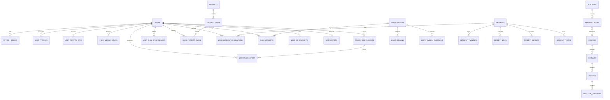

# CloudForge: Frontend-Backend API Contract & Architecture Specification

**Platform:** CloudForge — AI-Assisted Cloud & DevOps Engineering Platform  
**Backend Stack:** Python 3.12+, FastAPI, PostgreSQL, SQLAlchemy 2.x (Async), Alembic, Pydantic v2, JWT Auth, Pytest, Docker  
**Frontend Stack:** React 19, Vite, TypeScript, Tailwind CSS, React Router v6

---

## 1. Frontend Audit & Discovery

An in-depth inspection of the CloudForge frontend codebase (`src/`) reveals 21 routes, 9 core mock data models, and rich interactive workflows across 10 functional domains:

| Domain | Frontend Routes | Key Components & Interactions | Mock Data Source |
| :--- | :--- | :--- | :--- |
| **Authentication & Profile** | `/login`, `/register`, `/forgot-password`, `/profile`, `/settings` | Sign in, sign up with learning goal selection (`Cloud`, `DevOps`, `DevSecOps`, `Kubernetes`, `Cloud Security`, `AI Engineering`, `Certification`), password reset, user profile, settings (terminal preferences, notification toggles). | `userData.ts`, `AuthContext.tsx` |
| **Dashboard** | `/dashboard` | Greeting, 4 top KPIs (overall progress, 12-day streak, 38.5h hours, 3 certs), continue learning card, 52-week GitHub-style activity commit grid, weekly learning hours chart, skill progress bars, recommended next steps. | `userData.ts`, `skillsData.ts`, `coursesData.ts` |
| **Courses & Curriculum** | `/courses`, `/courses/:courseId` | Multi-filter catalog (domain, level, certificate, enrollment status), search bar, course overview, syllabus module accordion (completed, in-progress, locked lessons), learning outcomes, prerequisites. | `coursesData.ts` |
| **Interactive Lesson Player** | `/learn/:courseId/:lessonId` | 3-pane IDE layout: collapsible curriculum tree (left), lesson content with architecture diagrams & code blocks (center), knowledge check practice quiz with immediate feedback, mark complete action (+50 XP, updates user progress/streak), and contextual AI Copilot (right). | `coursesData.ts`, `AIChatPanel.tsx`, `PracticeQuiz.tsx` |
| **Career Roadmaps** | `/roadmaps`, `/roadmaps/:id` | 4 visual career pipelines (Cloud Engineer, DevOps Engineer, DevSecOps Engineer, AI + DevOps Engineer), step-by-step DAG milestones, status indicators, duration estimates, linked courses & target certifications. | `roadmapsData.ts` |
| **Technical Skills Matrix** | `/skills` | 10 technical competencies (Linux, Git, Docker, Kubernetes, Terraform, AWS, CI/CD, DevSecOps, Observability, AI Ops) with proficiency %, target levels, monthly trends, and associated courses/projects. | `skillsData.ts` |
| **Certifications Hub & Exam Simulator** | `/certifications`, `/certifications/:id` | 6 exam prep tracks (AWS CLF-C02, Azure AZ-900, AI-900, AWS Foundations, Kubernetes Foundations, DevOps Foundations), official exam domain weightings, practice question bank, and interactive timed mock exam modal (45m timer, A/B/C/D choices, scoring bar 70%, explanation review). | `certificationsData.ts`, `ExamSimulatorModal.tsx` |
| **Applied Projects** | `/projects`, `/projects/:id` | 8 real-world production projects, difficulty, estimated hours, architecture blueprint, step-by-step task checklist with CLI command snippets, deliverables, and automated deployment verification runner. | `projectsData.ts` |
| **Troubleshooting Center (Incident SRE Sandbox)** | `/troubleshooting`, `/troubleshooting/:id` | Incident queue (502 Bad Gateway, CrashLoopBackOff OOMKilled, GitHub Actions OIDC Failure, Argo CD OutOfSync, AWS IAM AccessDenied, Container CVE), severity (P1-P4), status (Active, Investigating, Resolved), chronological timeline, terminal logs with level filters (`ALL`, `ERROR`, `WARN`) & search, telemetry metrics chart, OpenTelemetry trace spans, one-click AI Root-Cause Diagnostic, and live configuration remediation patch. | `incidentsData.ts` |
| **AI Engineering Workbench** | `/ai` | 7-stage autonomous AI system workflow visualization, capability matrix, and interactive CI/CD Failure Analyzer (Docker TS build, Helm hook, Terraform S3 KMS errors) returning root cause, confidence score, and git diff patches. | `coursesData.ts`, `CICDLogAnalyzer.tsx`, `ArchitectureFlow.tsx` |
| **Global Platform Features** | Platform-wide | `Cmd/Ctrl + K` global Command Palette, notifications popover with unread tracking & mark-all-as-read, toast notification triggers. | `notificationsData.ts`, `achievementsData.ts` |

---

## 2. Backend Architecture Proposal

The backend will follow a **clean, layered modular architecture** separating concerns across API routing, business logic, data access, database models, and validation schemas:

```
backend/
├── app/
│   ├── __init__.py
│   ├── main.py                  # FastAPI application entrypoint, CORS, middleware, global handlers
│   ├── core/
│   │   ├── __init__.py
│   │   ├── config.py            # Pydantic Settings (ENV variables, Database URL, JWT Secrets, CORS)
│   │   ├── database.py          # SQLAlchemy 2.0 Async Engine, sessionmaker, Base model
│   │   └── security.py          # Password hashing (Argon2/bcrypt), JWT token encode/decode, user authentication
│   ├── models/                  # SQLAlchemy 2.0 Declarative Models (Database Tables)
│   │   ├── __init__.py
│   │   ├── user.py              # User, UserProfile, UserActivityDay, UserWeeklyHour
│   │   ├── course.py            # Course, Module, Lesson, CourseEnrollment, LessonProgress
│   │   ├── roadmap.py           # Roadmap, RoadmapNode, UserRoadmapProgress
│   │   ├── skill.py             # Skill, UserSkillProficiency
│   │   ├── certification.py     # Certification, ExamDomain, CertificationQuestion, ExamAttempt
│   │   ├── project.py           # Project, ProjectTask, UserProjectProgress
│   │   ├── incident.py          # Incident, IncidentTimeline, IncidentLog, IncidentMetric, IncidentTrace, UserIncidentResolution
│   │   ├── achievement.py       # Achievement, UserAchievement
│   │   └── notification.py      # Notification
│   ├── schemas/                 # Pydantic v2 Request/Response Schemas
│   │   ├── __init__.py
│   │   ├── auth.py              # Login, Register, Token, TokenPayload, PasswordReset
│   │   ├── user.py              # UserRead, UserProfileRead, UserUpdate, UserPreferences
│   │   ├── dashboard.py         # DashboardOverviewResponse
│   │   ├── course.py            # CourseRead, CourseDetailRead, ModuleRead, LessonRead, LessonProgressUpdate
│   │   ├── roadmap.py           # RoadmapRead, RoadmapDetailRead
│   │   ├── skill.py             # SkillRead, UserSkillUpdate
│   │   ├── certification.py     # CertificationRead, CertificationDetailRead, ExamSubmitRequest, ExamResultResponse
│   │   ├── project.py           # ProjectRead, ProjectDetailRead, TaskToggleRequest, VerifyProjectResponse
│   │   ├── incident.py          # IncidentRead, IncidentDetailRead, AIAnalyzeResponse, RemediateRequest
│   │   ├── ai.py                # AIChatRequest, AIChatResponse, CICDAnalyzeRequest, CICDAnalyzeResponse
│   │   ├── achievement.py       # AchievementRead
│   │   └── notification.py      # NotificationRead, NotificationUpdate
│   ├── repositories/            # Data Access Layer (Clean CRUD / SQLAlchemy queries)
│   │   ├── __init__.py
│   │   ├── base.py              # Generic CRUD repository base class
│   │   ├── user_repository.py
│   │   ├── course_repository.py
│   │   ├── roadmap_repository.py
│   │   ├── skill_repository.py
│   │   ├── certification_repository.py
│   │   ├── project_repository.py
│   │   ├── incident_repository.py
│   │   ├── achievement_repository.py
│   │   └── notification_repository.py
│   ├── services/                # Business Logic Layer (Progress calculations, streaks, XP, scoring, AI)
│   │   ├── __init__.py
│   │   ├── auth_service.py
│   │   ├── user_service.py
│   │   ├── dashboard_service.py
│   │   ├── course_service.py
│   │   ├── roadmap_service.py
│   │   ├── skill_service.py
│   │   ├── certification_service.py
│   │   ├── project_service.py
│   │   ├── incident_service.py
│   │   ├── ai_service.py
│   │   ├── achievement_service.py
│   │   └── notification_service.py
│   └── api/
│       ├── __init__.py
│       ├── deps.py              # FastAPI Dependency Injection (get_db, get_current_user, get_optional_user)
│       └── v1/
│           ├── __init__.py
│           ├── api.py           # Aggregated APIRouter for v1
│           └── endpoints/       # Route handlers
│               ├── __init__.py
│               ├── auth.py
│               ├── users.py
│               ├── dashboard.py
│               ├── courses.py
│               ├── roadmaps.py
│               ├── skills.py
│               ├── certifications.py
│               ├── projects.py
│               ├── incidents.py
│               ├── ai.py
│               ├── achievements.py
│               ├── notifications.py
│               └── search.py
├── alembic/                     # Database migrations
│   ├── env.py
│   ├── script.py.mako
│   └── versions/
├── tests/                       # Pytest test suite
│   ├── __init__.py
│   ├── conftest.py              # Test database fixtures, async test client
│   ├── test_auth.py
│   ├── test_courses.py
│   ├── test_incidents.py
│   └── test_certifications.py
├── alembic.ini
├── Dockerfile
├── docker-compose.yml
├── requirements.txt
└── pyproject.toml
```

---

## 3. Database Entity Relationship Model (PostgreSQL)

Below is the normalized relational schema to support all frontend state and persistence:



### Table Definitions

1. **`users`**: `id` (UUID, PK), `email` (VARCHAR, Unique), `hashed_password` (VARCHAR), `is_active` (BOOL), `is_verified` (BOOL), `learning_goal` (VARCHAR), `created_at` (TIMESTAMPTZ), `updated_at` (TIMESTAMPTZ).
2. **`user_profiles`**: `id` (UUID, PK), `user_id` (UUID, FK), `name` (VARCHAR), `handle` (VARCHAR, Unique), `role` (VARCHAR), `avatar_url` (VARCHAR), `learning_streak` (INT), `learning_hours` (FLOAT), `xp_points` (INT), `notify_outages` (BOOL), `notify_progress` (BOOL), `terminal_font_size` (VARCHAR), `theme_preference` (VARCHAR).
3. **`user_activity_days`**: `id` (UUID, PK), `user_id` (UUID, FK), `activity_date` (DATE), `event_count` (INT), `minutes_spent` (INT).
4. **`user_weekly_hours`**: `id` (UUID, PK), `user_id` (UUID, FK), `week_start_date` (DATE), `day_of_week` (VARCHAR: Mon-Sun), `hours` (FLOAT).
5. **`courses`**: `id` (UUID, PK), `slug` (VARCHAR, Unique), `title` (VARCHAR), `category` (VARCHAR), `level` (VARCHAR), `duration` (VARCHAR), `lessons_count` (INT), `description` (TEXT), `long_description` (TEXT), `technologies` (JSONB), `has_certificate` (BOOL), `rating` (FLOAT), `students_count` (INT), `instructor_name` (VARCHAR), `instructor_role` (VARCHAR), `instructor_avatar` (VARCHAR), `instructor_verified` (BOOL), `learning_outcomes` (JSONB).
6. **`modules`**: `id` (UUID, PK), `course_id` (UUID, FK), `number` (VARCHAR), `title` (VARCHAR), `order_index` (INT), `duration` (VARCHAR).
7. **`lessons`**: `id` (UUID, PK), `module_id` (UUID, FK), `slug` (VARCHAR), `title` (VARCHAR), `duration` (VARCHAR), `lesson_type` (VARCHAR: theory, hands-on, troubleshooting, quiz), `order_index` (INT), `estimated_time` (VARCHAR), `objectives` (JSONB), `description` (TEXT), `architecture_diagram` (TEXT), `sections` (JSONB), `practice_questions` (JSONB).
8. **`course_enrollments`**: `id` (UUID, PK), `user_id` (UUID, FK), `course_id` (UUID, FK), `progress_percentage` (INT), `is_completed` (BOOL), `enrolled_at` (TIMESTAMPTZ), `completed_at` (TIMESTAMPTZ), `certificate_code` (VARCHAR, Nullable).
9. **`lesson_progress`**: `id` (UUID, PK), `user_id` (UUID, FK), `lesson_id` (UUID, FK), `is_completed` (BOOL), `completed_at` (TIMESTAMPTZ).
10. **`roadmaps`**: `id` (UUID, PK), `slug` (VARCHAR, Unique), `title` (VARCHAR), `category` (VARCHAR), `description` (TEXT), `duration` (VARCHAR), `skills_count` (INT), `projects_count` (INT), `certifications_targeted` (JSONB).
11. **`roadmap_nodes`**: `id` (UUID, PK), `roadmap_id` (UUID, FK), `order_index` (INT), `title` (VARCHAR), `description` (TEXT), `estimated_hours` (VARCHAR), `skills` (JSONB), `course_id` (UUID, FK, Nullable).
12. **`skills`**: `id` (UUID, PK), `slug` (VARCHAR, Unique), `name` (VARCHAR), `category` (VARCHAR), `default_target_level` (VARCHAR).
13. **`user_skill_proficiencies`**: `id` (UUID, PK), `user_id` (UUID, FK), `skill_id` (UUID, FK), `proficiency` (INT: 0-100), `level_label` (VARCHAR), `target_level` (VARCHAR), `trend` (VARCHAR), `updated_at` (TIMESTAMPTZ).
14. **`certifications`**: `id` (UUID, PK), `code` (VARCHAR), `title` (VARCHAR), `provider` (VARCHAR), `level` (VARCHAR), `badge_icon` (VARCHAR), `duration` (VARCHAR), `training_title` (VARCHAR), `description` (TEXT), `training_certificate_name` (VARCHAR), `modules` (JSONB), `skills_gained` (JSONB).
15. **`exam_domains`**: `id` (UUID, PK), `certification_id` (UUID, FK), `name` (VARCHAR), `percentage` (INT).
16. **`certification_questions`**: `id` (UUID, PK), `certification_id` (UUID, FK), `domain_name` (VARCHAR), `question` (TEXT), `options` (JSONB), `correct_index` (INT), `explanation` (TEXT).
17. **`exam_attempts`**: `id` (UUID, PK), `user_id` (UUID, FK), `certification_id` (UUID, FK), `score_percentage` (INT), `correct_count` (INT), `total_questions` (INT), `is_passed` (BOOL), `user_answers` (JSONB), `created_at` (TIMESTAMPTZ).
18. **`projects`**: `id` (UUID, PK), `slug` (VARCHAR, Unique), `title` (VARCHAR), `difficulty` (VARCHAR), `estimated_hours` (VARCHAR), `description` (TEXT), `technologies` (JSONB), `skills` (JSONB), `github_url` (VARCHAR), `architecture_overview` (TEXT), `deliverables` (JSONB).
19. **`project_tasks`**: `id` (UUID, PK), `project_id` (UUID, FK), `order_index` (INT), `title` (VARCHAR), `command` (VARCHAR, Nullable).
20. **`user_project_tasks`**: `id` (UUID, PK), `user_id` (UUID, FK), `project_task_id` (UUID, FK), `is_completed` (BOOL), `completed_at` (TIMESTAMPTZ).
21. **`incidents`**: `id` (UUID, PK), `incident_id` (VARCHAR: e.g. INC-0042), `title` (VARCHAR), `severity` (VARCHAR), `severity_color` (VARCHAR: rose, amber, blue, slate), `technology` (VARCHAR), `default_status` (VARCHAR), `symptoms` (TEXT), `skills` (JSONB), `difficulty` (VARCHAR), `time_elapsed` (VARCHAR), `possible_root_cause` (TEXT), `ai_evidence` (JSONB), `ai_confidence` (INT), `recommended_investigation` (JSONB), `suggested_remediation` (TEXT), `remediation_command` (TEXT), `remediation_patch` (TEXT).
22. **`incident_timelines`**: `id` (UUID, PK), `incident_id` (UUID, FK), `event_time` (VARCHAR), `message` (TEXT), `status` (VARCHAR).
23. **`incident_logs`**: `id` (UUID, PK), `incident_id` (UUID, FK), `timestamp` (VARCHAR), `log_level` (VARCHAR: INFO, WARN, ERROR, FATAL), `source` (VARCHAR), `message` (TEXT).
24. **`incident_metrics`**: `id` (UUID, PK), `incident_id` (UUID, FK), `label` (VARCHAR), `metric_points` (JSONB).
25. **`incident_traces`**: `id` (UUID, PK), `incident_id` (UUID, FK), `trace_id` (VARCHAR), `spans` (JSONB).
26. **`user_incident_resolutions`**: `id` (UUID, PK), `user_id` (UUID, FK), `incident_id` (UUID, FK), `status` (VARCHAR: Active, Investigating, Resolved), `remediation_applied` (BOOL), `resolved_at` (TIMESTAMPTZ).
27. **`achievements`**: `id` (UUID, PK), `slug` (VARCHAR, Unique), `title` (VARCHAR), `description` (TEXT), `icon` (VARCHAR), `category` (VARCHAR), `xp_reward` (INT).
28. **`user_achievements`**: `id` (UUID, PK), `user_id` (UUID, FK), `achievement_id` (UUID, FK), `earned_at` (TIMESTAMPTZ).
29. **`notifications`**: `id` (UUID, PK), `user_id` (UUID, FK), `title` (VARCHAR), `description` (TEXT), `notification_type` (VARCHAR), `link` (VARCHAR), `is_read` (BOOL), `created_at` (TIMESTAMPTZ).

---

## 4. RESTful API Contract Specification

All endpoints are prefixed with `/api/v1`. Authentication uses standard `Bearer <JWT_TOKEN>` in the `Authorization` header.

### 4.1 Authentication & Profile (`/api/v1/auth`, `/api/v1/users`)

| Method | Endpoint | Description | Auth Required | Request Body | Response Body |
| :--- | :--- | :--- | :--- | :--- | :--- |
| `POST` | `/auth/register` | Register a new engineer account with goal | No | `RegisterRequest` (`name`, `email`, `password`, `learning_goal`) | `AuthResponse` (`access_token`, `refresh_token`, `token_type`, `user`) |
| `POST` | `/auth/login` | Email/Password login | No | `LoginRequest` (`email`, `password`) | `AuthResponse` (`access_token`, `refresh_token`, `token_type`, `user`) |
| `POST` | `/auth/refresh` | Refresh expired JWT access token | No | `RefreshTokenRequest` (`refresh_token`) | `TokenResponse` (`access_token`, `token_type`) |
| `POST` | `/auth/forgot-password` | Request password reset token email | No | `ForgotPasswordRequest` (`email`) | `MessageResponse` (`message: "Reset email dispatched"`) |
| `GET` | `/users/me` | Fetch authenticated user profile & stats | Yes | None | `UserProfileResponse` (`id`, `name`, `email`, `handle`, `role`, `avatar`, `stats`, `streak`, `xp`) |
| `PATCH` | `/users/me` | Update profile details and preferences | Yes | `UpdateProfileRequest` (`name?`, `handle?`, `role?`, `notify_outages?`, `notify_progress?`, `terminal_font_size?`, `theme_preference?`) | `UserProfileResponse` |

---

### 4.2 Dashboard (`/api/v1/dashboard`)

| Method | Endpoint | Description | Auth Required | Request Body | Response Body |
| :--- | :--- | :--- | :--- | :--- | :--- |
| `GET` | `/dashboard` | Complete dashboard payload: 4 KPIs, continue learning card, 52-week activity grid, weekly hours, skills, recommendations | Yes | None | `DashboardResponse` (`overall_progress`, `streak_days`, `learning_hours`, `certificates_count`, `continue_learning`, `activity_grid`, `weekly_hours`, `skills`, `recommendations`) |

---

### 4.3 Courses & Interactive Lessons (`/api/v1/courses`, `/api/v1/learn`)

| Method | Endpoint | Description | Auth Required | Query / Request Body | Response Body |
| :--- | :--- | :--- | :--- | :--- | :--- |
| `GET` | `/courses` | List courses with search & multi-filter | Optional | Query params: `q?`, `category?`, `level?`, `has_certificate?`, `enrolled_only?` | `CourseListResponse` (`items: CourseCardSchema[]`, `total`) |
| `GET` | `/courses/{course_id_or_slug}` | Detailed course view with module accordion | Optional | None | `CourseDetailResponse` (`id`, `title`, `slug`, `category`, `level`, `duration`, `technologies`, `instructor`, `learning_outcomes`, `modules`, `user_progress`) |
| `POST` | `/courses/{course_id}/enroll` | Enroll current user in course | Yes | None | `EnrollmentResponse` (`course_id`, `enrolled_at`, `progress_percentage`) |
| `GET` | `/courses/{course_id}/lessons/{lesson_id}` | Get lesson content for 3-pane player | Optional | None | `LessonDetailResponse` (`id`, `title`, `duration`, `estimated_time`, `objectives`, `description`, `architecture_diagram`, `sections`, `practice_questions`, `user_completed`, `next_lesson_id`, `prev_lesson_id`) |
| `POST` | `/courses/{course_id}/lessons/{lesson_id}/complete` | Mark lesson complete, award XP, update streak | Yes | None | `LessonCompleteResponse` (`lesson_id`, `xp_awarded: 50`, `course_progress_percentage`, `streak_days`, `achievement_unlocked?`) |

---

### 4.4 Roadmaps & Skills (`/api/v1/roadmaps`, `/api/v1/skills`)

| Method | Endpoint | Description | Auth Required | Request Body | Response Body |
| :--- | :--- | :--- | :--- | :--- | :--- |
| `GET` | `/roadmaps` | List all 4 career pipelines with user progress | Optional | None | `List[RoadmapSchema]` |
| `GET` | `/roadmaps/{roadmap_id_or_slug}` | Detailed roadmap with DAG node milestones | Optional | None | `RoadmapDetailSchema` (`id`, `title`, `description`, `duration`, `nodes: RoadmapNodeSchema[]`, `certifications_targeted`) |
| `GET` | `/skills` | Get user skill matrix & benchmark levels | Optional | Query: `category?` | `List[SkillSchema]` (`id`, `name`, `category`, `proficiency`, `level_label`, `target_level`, `trend`, `related_courses`, `related_projects`) |

---

### 4.5 Certifications, Training Tracks, Practice Exams & Certificates (`/api/v1/certifications`, `/api/v1/trainings`, `/api/v1/practice-attempts`, `/api/v1/certificates`)

| Method | Endpoint | Description | Auth Required | Request Body | Response Body |
| :--- | :--- | :--- | :--- | :--- | :--- |
| `GET` | `/certifications` | List certification prep catalog | Optional | Query: `provider?`, `category?`, `level?` | `List[CertificationSummaryResponse]` |
| `GET` | `/certifications/{slug_or_id}` | Detailed exam prep track with blueprints and training tracks | Optional | None | `CertificationDetailResponse` (`id`, `code`, `title`, `provider`, `domains`, `trainings`, `skills_gained`, `practice_questions_count`, `progress`) |
| `GET` | `/certifications/{cert_id}/trainings` | List training programs for certification | Optional | None | `List[TrainingSummaryResponse]` |
| `GET` | `/trainings/{training_id}` | Detailed training syllabus and linked course preview | Optional | None | `TrainingDetailResponse` (`id`, `title`, `course_title`, `course_slug`, `total_lessons`, `completed_lessons`, `progress_percentage`) |
| `POST` | `/trainings/{training_id}/enroll` | Enroll student in certification training program | Yes | None | `TrainingSummaryResponse` (`status: "in_progress"`, `progress_percentage`) |
| `GET` | `/trainings/{training_id}/progress` | Real progress calculated from lesson completions | Yes | None | `TrainingProgressResponse` (`progress_percentage`, `completed_lessons`, `total_lessons`, `is_eligible_for_certificate`) |
| `POST` | `/trainings/{training_id}/complete` | Mark training completed and issue CloudForge certificate idempotently | Yes | None | `CertificateResponse` (`id`, `certificate_number`, `verification_code`, `recipient_name`, `training_title`, `status`) |
| `POST` | `/certifications/{cert_id}/practice-attempts` | Start practice quiz/exam attempt (omits correct answers/explanations) | Yes | `PracticeAttemptStartRequest` (`attempt_type: "practice_exam"`, `question_count: 5`) | `PracticeAttemptDetailResponse` (`id`, `questions: List[PracticeQuestionPublicResponse]`, `total_questions`, `started_at`) |
| `GET` | `/practice-attempts/{attempt_id}` | Retrieve attempt session questions | Yes | None | `PracticeAttemptDetailResponse` |
| `POST` | `/practice-attempts/{attempt_id}/submit` | Submit answers for server-side evaluation | Yes | `PracticeAttemptSubmitRequest` (`answers: Dict[q_id, option_idx]`, `time_spent_seconds`) | `PracticeAttemptResultResponse` (`score`, `percentage`, `passed`, `question_results: List[QuestionReviewResponse]`) |
| `GET` | `/practice-attempts/{attempt_id}/results` | Review graded attempt results and explanations | Yes | None | `PracticeAttemptResultResponse` |
| `GET` | `/practice-attempts` | Student history of previous quiz and exam attempts | Yes | Query: `certification_id?`, `attempt_type?`, `passed?` | `List[PracticeAttemptSummaryResponse]` |
| `GET` | `/certificates` | List authenticated student's earned certificates | Yes | None | `List[CertificateResponse]` |
| `GET` | `/certificates/{certificate_id}` | Get certificate details | Yes | None | `CertificateResponse` |
| `GET` | `/certificates/verify/{verification_code}` | Public certificate verification (strictly omits private student data) | No | None | `CertificateVerifyResponse` (`is_valid`, `certificate_number`, `recipient_name`, `training_title`, `issued_at`, `status`) |

---

### 4.6 Applied Projects (`/api/v1/projects`)

| Method | Endpoint | Description | Auth Required | Request Body | Response Body |
| :--- | :--- | :--- | :--- | :--- | :--- |
| `GET` | `/projects` | List all 8 real-world production projects | Optional | Query: `difficulty?` | `List[ProjectSchema]` |
| `GET` | `/projects/{project_id_or_slug}` | Get project spec, architecture & tasks | Optional | None | `ProjectDetailSchema` (`id`, `title`, `description`, `architecture_overview`, `technologies`, `skills`, `deliverables`, `tasks: ProjectTaskSchema[]`, `user_progress`) |
| `POST` | `/projects/{project_id}/tasks/{task_id}/toggle` | Toggle completion of project milestone task | Yes | `TaskToggleRequest` (`completed: bool`) | `TaskToggleResponse` (`task_id`, `completed`, `project_progress_percentage`) |
| `POST` | `/projects/{project_id}/verify` | Run automated deployment verification test | Yes | None | `ProjectVerifyResponse` (`status: "SUCCESS" | "FAILED"`, `output: str`, `checks_passed: int`) |

---

### 4.7 Troubleshooting Center (Incident SRE Sandbox) (`/api/v1/incidents`)

| Method | Endpoint | Description | Auth Required | Request Body | Response Body |
| :--- | :--- | :--- | :--- | :--- | :--- |
| `GET` | `/incidents` | List active/resolved incident queue | Optional | Query: `status?` | `List[IncidentSummarySchema]` |
| `GET` | `/incidents/{incident_id}` | Get full incident console (logs, metrics, traces, timeline) | Optional | None | `IncidentDetailSchema` (`id`, `incident_id`, `title`, `severity`, `technology`, `symptoms`, `timeline`, `logs`, `metrics`, `traces`, `user_status`) |
| `POST` | `/incidents/{incident_id}/analyze-ai` | Run AI diagnostic reasoning over telemetry | Yes | None | `AIIncidentAnalysisResponse` (`possible_root_cause`, `evidence`, `confidence`, `recommended_investigation`, `suggested_remediation`, `remediation_command`, `remediation_patch`) |
| `POST` | `/incidents/{incident_id}/remediate` | Apply configuration patch & mark resolved | Yes | `RemediateRequest` (`patch_applied: bool`) | `RemediateResponse` (`status: "Resolved"`, `remediation_applied: true`, `xp_awarded: 800`, `message: str`) |

---

### 4.8 AI Engineering Workbench (`/api/v1/ai`)

| Method | Endpoint | Description | Auth Required | Request Body | Response Body |
| :--- | :--- | :--- | :--- | :--- | :--- |
| `POST` | `/ai/chat` | Contextual AI chat copilot for lesson player | Yes | `AIChatRequest` (`lesson_id`, `lesson_title`, `course_title`, `message`, `history`) | `AIChatResponse` (`reply: str`, `code_snippet?: str`) |
| `POST` | `/ai/analyze-cicd` | CI/CD build error log parser & diff patch generator | Yes | `CICDAnalyzeRequest` (`log_type: "docker"|"helm"|"terraform"|"custom"`, `raw_log: str`) | `CICDAnalyzeResponse` (`root_cause`, `confidence`, `suggested_fix`, `diff_patch`) |

---

### 4.9 Gamification, Notifications & Search (`/api/v1/achievements`, `/api/v1/notifications`, `/api/v1/search`)

| Method | Endpoint | Description | Auth Required | Request Body | Response Body |
| :--- | :--- | :--- | :--- | :--- | :--- |
| `GET` | `/achievements` | List all badges with user earned status | Optional | Query: `category?` | `List[AchievementSchema]` (`id`, `title`, `description`, `icon`, `category`, `xp`, `earned`, `earned_date?`) |
| `GET` | `/notifications` | Get user notifications list | Yes | None | `List[NotificationSchema]` (`id`, `title`, `description`, `time_ago`, `read`, `type`, `link`) |
| `POST` | `/notifications/mark-all-read` | Mark all notifications as read | Yes | None | `MessageResponse` (`message: "All notifications marked as read"`) |
| `PATCH` | `/notifications/{notification_id}/read` | Mark single notification as read | Yes | None | `NotificationSchema` |
| `GET` | `/search` | Global Command Palette search (`Cmd+K`) | Optional | Query: `q` | `List[SearchItemSchema]` (`id`, `title`, `subtitle`, `category`, `url`) |

---

## 5. Next Incremental Implementation Phase

Per the plan, work will proceed in structured phases:

1. **Phase 1: Project Setup & Foundation**
   - Create `backend/` directory structure.
   - Configure `pyproject.toml`, `requirements.txt`, `.env.example`.
   - Implement `app/core/config.py`, `app/core/database.py`, and `app/core/security.py`.
   - Setup `Dockerfile`, `docker-compose.yml` (FastAPI + PostgreSQL 16), and `alembic/`.
   - Establish `app/main.py` with health check endpoint (`/healthz`).
2. **Phase 2: Authentication & User Profiles**
   - Database models and Alembic migration for `users`, `user_profiles`, `user_activity_days`, `user_weekly_hours`.
   - Password hashing, JWT token generation & verification, `get_current_user` dependency.
   - Auth endpoints (`/api/v1/auth/register`, `/login`, `/me`) & User profile settings endpoints.
3. **Phase 3: Courses, Curriculum & Lesson Player**
   - Models & endpoints for courses, modules, lessons, enrollments, and progress tracking (+XP).
   - Seed script with full 9 course curricula.
4. **Phase 4: Roadmaps, Skills & Certifications Hub**
   - Models & endpoints for roadmaps, skill matrices, certification tracks, and exam simulator submissions.
5. **Phase 5: Projects, Troubleshooting Center & AI Workbench**
   - Models & endpoints for applied projects, incident investigations (terminal logs/metrics/AI root cause), and CI/CD log analyzer.
6. **Phase 6: Frontend API Integration & Full E2E Verification**
   - Replace mock data providers in React with `axios`/`fetch` API clients.
   - Validate full browser flow with PostgreSQL.
