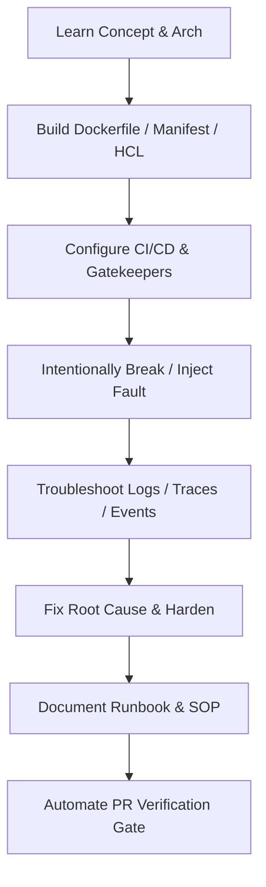
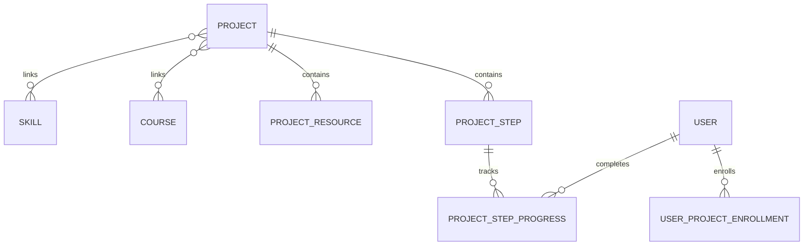

# CloudForge Phase 7: Projects & DevOps Engineering Workflows

## 1. Overview & Pedagogical Philosophy

CloudForge Projects bridge conceptual learning (from Courses, Roadmaps, and Certifications) with hands-on, production-grade DevOps and Cloud engineering workflows.

Every project adheres strictly to the CloudForge engineering lifecycle:
$$\text{Learn} \longrightarrow \text{Build} \longrightarrow \text{Break} \longrightarrow \text{Troubleshoot} \longrightarrow \text{Fix} \longrightarrow \text{Document} \longrightarrow \text{Automate}$$

### Engineering Workflows Covered
1. **Git**: Trunk-based workflows, signed commits, pre-commit secret detection, and branch protection gates.
2. **CI/CD**: Deterministic GitHub Actions workflows, matrix test runners, build layer caching, and OIDC auth.
3. **Docker**: Secure multi-stage Dockerfiles, unprivileged non-root execution, cgroups/namespaces, and OCI image optimization.
4. **Security Scanning**: Static code analysis (Semgrep), secret scanning (Gitleaks), container vulnerability auditing (Trivy), and SBOM generation (Syft).
5. **Container Registry**: Keyless signing (Cosign / Sigstore), image verification, and GHCR publishing.
6. **Kubernetes**: Declarative manifests, Pods, Services, Ingress, ConfigMaps, Secrets, HPA, PDBs, and NetworkPolicies.
7. **GitOps**: Automated reconciliation, drift detection, and canary rollouts with Argo CD and Argo Rollouts.
8. **Observability**: RED & USE monitoring methods, Prometheus metrics, Grafana dashboards, Loki log aggregation, and OpenTelemetry distributed traces.
9. **Troubleshooting**: Diagnosing CrashLoopBackOff, OOMKilled (Exit 137), ImagePullBackOff, network partition timeouts, and lock contention.

---

## 2. Architecture & Domain Models

The Projects domain is modeled in PostgreSQL using SQLAlchemy 2.x and Alembic migrations.

### Models Summary

| Table | Model Class | Description | Primary Key | Constraints / Indexes |
|---|---|---|---|---|
| `projects` | `Project` | Master project catalog entry | `id` (UUIDv4) | `uq_projects_slug`, `ix_projects_status`, `ix_projects_difficulty` |
| `project_steps` | `ProjectStep` | Sequential engineering milestone | `id` (UUIDv4) | `uq_project_step_order(project_id, step_order)`, `fk_project_id` ON DELETE CASCADE |
| `project_resources` | `ProjectResource` | Diagrams, repos, RFCs, and guides | `id` (UUIDv4) | `fk_project_id` ON DELETE CASCADE, `ix_display_order` |
| `project_courses` | `ProjectCourse` | Many-to-Many course associations | `(project_id, course_id)` | Composite PK, Foreign keys ON DELETE CASCADE |
| `project_skills` | `ProjectSkill` | Many-to-Many skill associations | `(project_id, skill_id)` | Composite PK, Foreign keys ON DELETE CASCADE |
| `user_project_enrollments` | `UserProjectEnrollment` | User enrollment and status | `id` (UUIDv4) | `uq_user_project_enrollment(user_id, project_id)`, Foreign keys |
| `project_step_progress` | `ProjectStepProgress` | Step completion state and notes | `id` (UUIDv4) | `uq_user_project_step_progress(user_id, project_step_id)`, Foreign keys |

---

## 3. Why Project Progress is Derived (Not Manually Stored)

1. **Tamper-Proof Progression**: Storing arbitrary percentage values allows malicious frontend clients or network intercepts to send `{"progress": 100}` and fabricate completion. In CloudForge, progress is calculated dynamically by the backend:
$$\text{Progress \%} = \text{round}\left(\frac{\text{Completed Required Steps}}{\text{Total Required Steps}} \times 100, 1\right)$$
2. **Single Source of Truth**: Step progression records (`project_step_progress`) are the immutable atomic facts. If project syllabus steps are added or reorganized, progress naturally adapts without data corruption or manual reconciliation.
3. **Deterministic Completion**: A project transitions to `completed` if and only if every required step is completed.

---

## 4. Deterministic & Idempotent Completion

1. When a user calls `POST /api/v1/projects/{project_id}/steps/{step_id}/complete`:
   - The repository performs an atomic upsert on `project_step_progress`.
   - If newly completed, an audit event `ActivityType.PROJECT_STEP_COMPLETED` is logged to `learning_activities`.
   - The service evaluates whether all required steps for the project are finished.
   - When all required steps are satisfied, `user_project_enrollments.status` is set to `completed`, `completed_at` is stamped with the UTC timestamp, and `ActivityType.PROJECT_COMPLETED` is emitted.
2. Repeated invocations with the same step payload are completely idempotent:
   - Existing `completed_at` timestamps are preserved.
   - Duplicate `learning_activities` logs are suppressed.

---

## 5. Role-Based Access Control (RBAC)

| Endpoint | Role Required | Behavioral Constraints |
|---|---|---|
| `GET /api/v1/projects` | Public / Optional Auth | Students only see `published` projects; Instructors/Admins can see `draft` and `archived` |
| `GET /api/v1/projects/{slug}` | Public / Optional Auth | Draft projects return `404 Not Found` for unauthenticated users and students |
| `GET /api/v1/projects/my` | Authenticated (`student`, `instructor`, `admin`) | Returns only projects enrolled by the requesting user |
| `POST /api/v1/projects/{id}/enroll` | Authenticated (`student`, `instructor`, `admin`) | Enrolls user; idempotent on repeat calls |
| `GET /api/v1/projects/{id}/progress` | Authenticated (`student`, `instructor`, `admin`) | Returns calculated step breakdown and percentage |
| `POST /api/v1/projects/{id}/steps/{step_id}/start` | Authenticated (`student`, `instructor`, `admin`) | Marks step `in_progress` |
| `POST /api/v1/projects/{id}/steps/{step_id}/complete` | Authenticated (`student`, `instructor`, `admin`) | Completes step and evaluates project completion |

---

## 6. Seeded Projects Reference

| # | Project Title | Slug | Difficulty | Hours | Key Skills | Key Courses |
|---|---|---|---|---|---|---|
| 1 | **CloudForge CI/CD Pipeline** | `cloudforge-cicd-pipeline` | Intermediate | 12h | CI/CD, Docker, Git, DevSecOps | DevOps Foundations, DevSecOps |
| 2 | **Containerized Web Platform** | `containerized-web-platform` | Beginner | 10h | Docker, Linux | DevOps Foundations |
| 3 | **Kubernetes Production Deployment** | `kubernetes-production-deployment` | Intermediate | 16h | Kubernetes, Docker, Helm | Kubernetes Engineering |
| 4 | **GitOps Deployment Platform** | `gitops-deployment-platform` | Advanced | 18h | GitOps, Kubernetes, Helm, CI/CD | GitOps with Argo CD, Kubernetes Engineering |
| 5 | **DevSecOps Pipeline** | `devsecops-pipeline` | Advanced | 16h | DevSecOps, CI/CD, Docker, Kubernetes | DevSecOps Engineering, Security & Compliance |
| 6 | **Observability Platform** | `observability-platform` | Intermediate | 14h | Observability, Kubernetes, Linux | Observability Engineering, DevOps Foundations |
| 7 | **Terraform AWS Infrastructure** | `terraform-aws-infrastructure` | Intermediate | 15h | Terraform, AWS, Linux | IaC with Terraform, Cloud Foundations |
| 8 | **AI Incident Intelligence Platform** | `ai-incident-intelligence-platform` | Advanced | 20h | AI + DevOps, Python, Kubernetes, Observability | AI for Cloud & DevOps, Observability |
